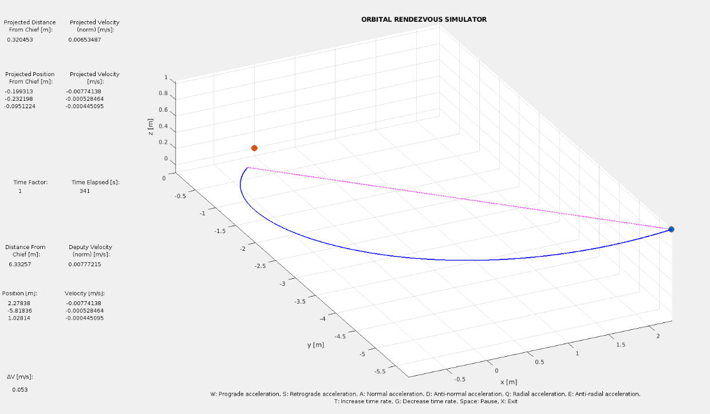

# Orbital Free Flyer Analysis Tool

Federico Mustich *(federico.mustich@studenti.polito.it)*\
Lorenzo Porpiglia *(lorenzo.porpiglia@studenti.polito.it)*\
Gaetana Gaia Spanò *(gaetana.spano@studenti.polito.it)*\
Vincenzo Trentacapilli *(vincenzo.trentacapilli@studenti.polito.it)*

Final project for the course of *Orbital Robotics and Distributed Space Systems* at Politecnico di Torino from Prof.
Marcello Romano.

## Introduction

This project aims to provide a tool to analyze the orbital motion of a free flyer (Deputy) in the proximity of a target
(Chief).
The tool is based on the *Hill-Clohessy-Wiltshire* equations.

## Translational Motion

### Part 1: Evolution in time of the position of Deputy w.r.t. Chief

The first script (*HCW_IC_MakeFigs.m*) aims to replicate some figures reported in the book ”*Fundamentals of
Astrodynamics and Applications*” (D. Vallado), which plots the evolution in time of the position
of Deputy with respect to Chief given different initial conditions on position and 
velocity by resolving the Hill-Clohessy-Wiltshire set of equations.

Usage: `HCW_IC_MakeFigs.m` on MATLAB command window.

### Part 2: Minimum total V two-impulse maneuver

The second script (*TwoImp_min.m*) computes the minimum total V two-impulse maneuvers, knowing the inizial conditions
of position and velocity of Deputy w.r.t.target. The function solves the Hill-Clohessy_wiltshire equations 
by considering a maximum final time equal to half orbit period.

Usage: `[Delta_V, Delta_v_comp, t_DV_min ] = TwoImp_min(PosVelDeputy,PosVelChief, mean_motion, Orbital_period)` in MATLAB
code

### Part 3: Game-like Simulation of Rendezvous between Deputy and Chief

The third script simulates the rendezvous between Deputy and Chief.
The deputy is initially setted at a random position and velocity. The chief is considered fixed at the origin.
The deputy's trajectory is computed using the HCW equations. The user can control the deputy's trajectory using the
keyboard.
- __W__: increase the deputy's velocity along the x-axis (Prograde acceleration)
- __S__: decrease the deputy's velocity along the x-axis (Retrograde acceleration)
- __A__: increase the deputy's velocity along the y-axis (Normal acceleration)
- __D__: decrease the deputy's velocity along the y-axis (Anti-normal acceleration)
- __Q__: increase the deputy's velocity along the z-axis (Radial acceleration)
- __E__: decrease the deputy's velocity along the z-axis (Anti-radial acceleration)
- __P__: pause the simulation
- __T__: increase the time rate of the simulation
- __G__: decrease the time rate of the simulation
- __SPACE__: pause the simulation
- __X__: exit the simulation

The goal is to reach the chief's position (with a tolerance of 0.5 m) with a safe velocity (with a tolerance of 0.01 m/s).

__WARNING: BEWARE OF THE PERSPECTIVE! A 3D trajectory plotted on a 2D screen could
be misleading. FOCUS ON THE VALUES OF THE UI ELEMENTS TO UNDERSTAND THE
DEPUTY'S POSITION AND VELOCITY W.R.T. THE CHIEF, IN PARTICULAR THE PROJECTED
POSITION FROM CHIEF.__

Usage: `Rendezvous_Simulator.m` on MATLAB command window.

## Rotational-Internal Motion

 
### FFP6L5R Robot Description

This script creates the data structure 'robot' where will be found the parameters of the free-flyer, like masses and geometrical parameters. It will be the input of the script named "FF6L_5R_Robot_Simulate".

### FFP6L5R - Robot Simulate

Starting from the data stored in "robot" the script computes the motion of the moving base robotic manipulator following the process of the recursive analysis, by developing the equations of motion and numerically integrating them. The evolution of the motion, while no torques are acting on the revolute joints, is studied and the gravitational effect is included. 

### FFP6L5R - Robot Figures

This script plots the states of the angles and angular rates of the joints, with the momenta characterizing the motion of the free-flyer and finally an animation (in postprocessing) of the motion of the system.

Usage: Open the three scripts and run the script `FFP6L5R - Robot Figures`.

## References

- D. Vallado, *Fundamentals of Astrodynamics and Applications*, 4th ed., Microcosm Press, Hawthorne, CA, 2013.
- M. Romano, *Orbital Robotics and Distributed Space Systems - Lecture Notes*, Politecnico di Torino, 2023.
